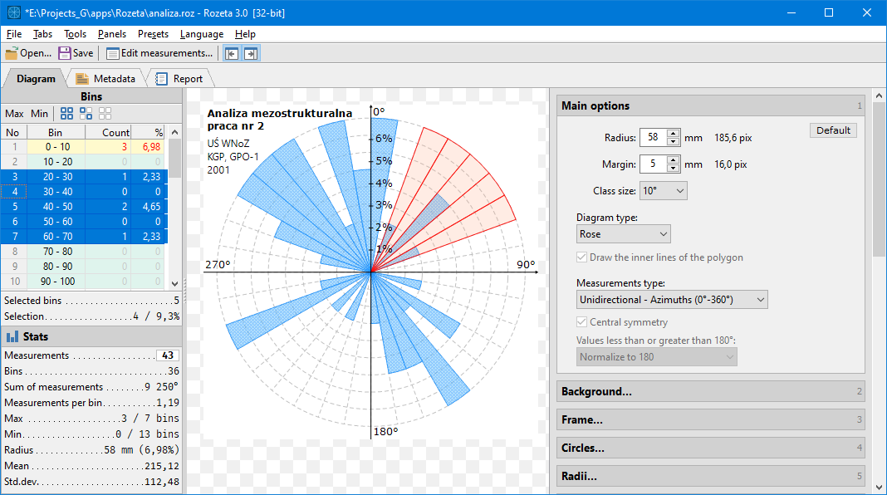
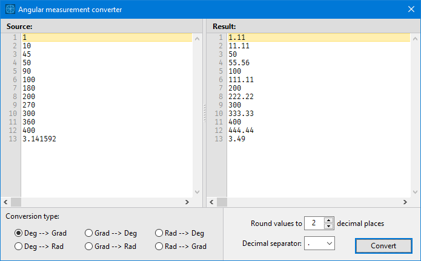
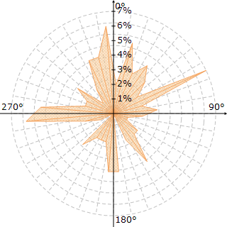

# Rozeta - Opis programu

[English version / wersja angielska](Rozeta_description_EN.md)

## O programie

**Rozeta** jest programem kreślącym diagramy rozetowe.

Diagram rozetowy jest histogramem kołowym, na którym przedstawia się rozkład elementów liniowych na płaszczyźnie. Może to być np. rozkład kierunków transportu w basenie sedymentacyjnych, nachylenia płaszczyzn spękań, szczelin uskokowych, kierunków paleoprądów, wiatrów itd.

Diagramy tego typu często wykorzystuje się w geologii strukturalnej, geografii i innych naukach.

## Informacje techniczne

Rozeta działa prawidłowo w systemie Windows 7 lub nowszym.

Program jest udostępniany w postaci archiwum ZIP. Przed uruchomieniem wypakuj wszystkie pliki do utworzonego wcześniej katalogu. Ponieważ program zapisuje pliki z danymi konfiguracyjnymi w bieżącym katalogu (z plikiem wykonywalnym EXE), nie może to być katalog chroniony przez system.

Program jest przenośny (**portable**) i nie zapisuje danych w żadnym innym miejscu (np. w rejestrze systemowym), dlatego możesz go skopiować na napęd przenośny (np. pendriva) i używać na innym komputerze.

Jeśli chcesz, możesz powiązać pliki `.roz` (pliki tekstowe w formacie JSON) i `.rozx` (skompresowane ZIP-em pliki ROZ) z programem Rozeta. Pamiętaj tylko, że skojarzenie jest zapisywane w rejestrze systemowym, więc jeśli usuniesz program z dysku, będziesz musiał usunąć skojarzenie w rejestrze samodzielnie.

Pliki `.rozt` są plikami szablonów. Zapisywane są w nich tylko parametry wizualne diagramu, bez pomiarów.  
Aby zapisać bieżące ustawienia diagramu do szablonu, wybierz menu `Presety` -> `Zapisz ustawienia diagramu do pliku z szablonem...` (skrót klawiszowy `Ctrl+Shift+T`) . 
Aby wczytać szablon, wybierz menu `Presety` -> `Wczytaj ustawienia diagramu z szablonu...` (skrót klawiszowy `Ctrl+Shift+L`).

## Licencja i pobieranie

Program jest całkowicie darmowy (**public domain**) i możesz z niego korzystać bez żadnych ograniczeń, także w celach komercyjnych.

Strona domowa programu (z plikami do pobrania): [https://www.pazera-software.com/products/rozeta/](https://www.pazera-software.com/products/rozeta/)  
Kod źródłowy: [https://github.com/jackdp/Rozeta](https://github.com/jackdp/Rozeta)  
Wsparcie dla autora (dobrowolne): [https://www.pazera-software.com/donation/](https://www.pazera-software.com/donation/)

## Pomiary

Jako dane wejściowe należy podać serię pomiarów kątowych w stopniach. Do wprowadzania danych służy okno **Pomiary**. Aby je wyświetlić, wybierz menu `Plik`->`Edytuj pomiary...` lub wciśniej klawisz `F4`.

Wartości pomiarów powinny być liczbami całkowitymi lub rzeczywistymi (zmiennoprzecinkowymi). Separatorem dziesiętnym może być `.` (kropka) lub `,` (przecinek).
W jednej linii należ podać jeden pomiar. Linie puste oraz linie zawierające nieprawidłowe wartości są ignorowane.

Jeżeli posiadasz pomiary w gradach lub radianach, możesz przeliczyć je na stopnie za pomocą wbudowanego **Konwertera pomiarów kątowych** (klawisz `F6`).

## Kreślenie diagramu

Na początku program tworzy przedziały liczbowe (kątowe) o wielkości podanej na liście rozwijalnej **Wielkość klasy** (domyślnie 36 przedziałów 10-stopnowych).

Każdy z wprowadzonych wcześniej pomiarów jest przydzielany do odpowiedniego przedziału kątowego. Wszystkie przedziały (oprócz pierwszego) są lewostronnie otwarte i prawostronnie domknięte (przy ustawieniach domyślnych wartość 10° zostanie zakwalifikowana do 1-szego przedziału, wartość 11° - do drugiego). 0° należy do przedziału pierwszego, 360° do ostatniego.

Promień diagramu reprezentuje ilość pomiarów w przedziale/przedziałach z największą ilością pomiarów.

W zależności od wybranego typu diagramu, metoda rysowania jest następująca:

1. **Rozeta "klasyczna"** (wycinki koła)  
Dla każdego przedziału kątowego z ilością pomiarów większą od 0 kreślony jest wycinek koła o długości proporcjonalnej do wcześniej wyznaczonego promienia i ilości pomiarów w tym przedziale.

2. **Wielokąt**  
Dla każdego przedziału kątowego z ilością pomiarów większą od 0 zaznaczany jest punkt pośrodku tego przedziału (np. 15° dla przedziału 10°-20°) w odległości proporcjonalnej do wcześniej wyznaczonego promienia i ilości pomiarów w danym przedziale. Jeżeli przedział nie zawiera żadnych pomiarów, zaznaczany jest punkt zerowy. Po wyznaczeniu wszystkich punktów są one łączone liniami prostymi tworząc wielokąt.

|                   Rozeta                    |                    Wielokąt                    |
| ------------------------------------------- | ---------------------------------------------- |
| **1**  | **2**  |

## Typy diagramów w zależności od rodzaju pomiarów

Program umożliwia kreślenie diagramów dla dwóch rodzajów pomiarów: azymutów i kierunków (biegów).

### Diagramy azymutów

Pomiary powinny być wartościami od 0 do 360 stopni, a na liście `Typ pomiarów` należy wybrać pozycję `Jednokierunkowe - Azymuty (0°-360°)`. Wartości pomiarów spoza zakresu 0..360 zostaną zignorowane.

|               Diagram azymutów               |
| -------------------------------------------- |
|  |

### Diagramy biegów

Diagram w połówce koła lub w pełnym kole z włączoną symetrią środkową.
W tym przypadku liczy się tylko bieg elementów. Należy podać wartości od 0 do 180 stopni, a na liście `Typ pomiarów` wybrać `Dwukierunkowe - Biegi (0°-180°)`.

|            Diagram biegów w połówce koła            |         Diagram biegów - Symetria środkowa          |
| --------------------------------------------------- | --------------------------------------------------- |
| **A**  | **B**  |

Jeśli w serii pomiarowej znajdują się wartości spoza zakresu liczbowego 0..180, program może takie wartości zignorować lub "znormalizować" do 180, tzn. tyle razy dodać lub odjąc od danego pomiaru wartość 180, aby otrzymać wartość z zakresu 0..180 (np. pomiar 230 zostanie wtedy zinterpretowany jako 230 - 180, czyli **50**).

Domyślnie kreślony jest diagram w połówce koła (**A**). Dla lepszej czytelności diagramu możesz jednak włączyć symetrię środkową (**B**), wówczas każdy wycinek diagramu zostanie również narysowany w ćwiartce przeciwległej. Symetria środkowa jest używana tylko przy rysowaniu diagramu, wartości pomiarów i statystyki nie zostaną zmodyfikowane.

## Skróty klawiszowe

| Skrót klawiszowy |                         Funkcja                         |
| ---------------- | ------------------------------------------------------- |
| Ctrl+1           | Rozwiń panel - Opcje główne                             |
| Ctrl+2           | Rozwiń panel - Tło                                      |
| Ctrl+3           | Rozwiń panel - Ramka                                    |
| Ctrl+4           | Rozwiń panel - Okręgi                                   |
| Ctrl+5           | Rozwiń panel - Promienie                                |
| Ctrl+6           | Rozwiń panel - Osie                                     |
| Ctrl+7           | Rozwiń panel - Wycinki                                  |
| Ctrl+8           | Rozwiń panel - Zaznaczony przedział                     |
| Ctrl+9           | Rozwiń panel - Tytuł i opis                             |
| Ctrl+Shift+E     | Rozwiń wszystkie panele                                 |
| Ctrl+Shift+C     | Zwiń wszystkie panele                                   |
| Ctrl+O           | Plik - Otwórz...                                        |
| Ctrl+S           | Plik - Zapisz                                           |
| Ctrl+Shift+S     | Plik - Zapisz jako...                                   |
| Ctrl+Shift+R     | Plik - Zapisz raport...                                 |
| Ctrl+Shift+P     | Plik - Zapisz diagram jako plik PNG...                  |
| F4               | Plik - Edytuj listę pomiarów...                         |
| Ctrl+Shift+X     | Plik - Zamknij plik                                     |
| F5               | Odśwież diagram                                         |
| F6               | Narzędzia - Konwerter pomiarów kątowych                 |
| F7               | Narzędzia - Diagram losowy                              |
| F12              | Pokaż / ukryj lewy panel (z listą przedziałów)          |
| Ctrl+F12         | Pokaż / ukryj prawy panel (z opcjami diagramu)          |
| Ctrl+D           | Przejdź do zakładki - Diagram                           |
| Ctrl+M           | Przejdź do zakładki - Metadane                          |
| Ctrl+R           | Przejdź do zakładki - Raport                            |
| Ctrl+Shift+L     | Wczytaj ustawienia z pliku z szablonem...               |
| Ctrl+Shift+T     | Zapisz ustawienia do szablonu...                        |
| Ctrl+Shift+F1    | O programie...                                          |
| Ctrl+Shift+F12   | Przeładuj bieżący plik z tłumaczeniem (for translators) |
| Ctrl+Shift+I     | Kilka informacji technicznych (Debug info)              |

## Historia

Pierwszą wersję programu napisałem w 2001 roku, gdy studiowałem geologię.  
Kiedy po raz kolejny dostałem zadanie narysowania diagramu rozetowego, postanowiłem napisać program do kreślenia diagramów rozetowych na podstawie pomiarów zapisanych w pliku tekstowym. Do napisania programu wykorzystałem środowisko programistyczne Borland Delphi 5. Programu nigdy nie udostępniłem (nie miałem wtedy nawet stałego łącza internetowego). Z programu korzystała tylko wąska grupa moich znajomych, którzy wykorzystali go m.in. przy pisaniu prac magisterskich.

Drugą wersję wydałem w roku 2003 (wersja polska) i 2004 (wersja angielska).  
Program miał już nieco więcej opcji i był dostępny na mojej stronie internetowej. Niestety zawierał kilka błędów, które prawie uniemożliwiały korzystanie z niego w nowszych wersjach systemu Windows, dlatego po kilku latach usunąłem go ze swojej strony.

Przeglądając kody źródłowe moich starych programów natknąłem się na Rozetę i postanowiłem napisać kolejną wersję, 3-cią.  
Początkowo chciałem rozbudować wersję 2.0, ale zależało mi aby program był otwartoźródłowy i wykorzystywał tylko darmowe narzędzia programistyczne, więc napisałem Rozetę całkowicie od nowa w środowisku [Lazarus](https://www.lazarus-ide.org/).

Skąd nazwa **Rozeta**? *Rozeta* to popularna nazwa diagramu rozetowego używana przez studentów geologii (a przynajmniej tak było 21 lat temu).
